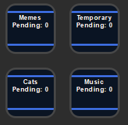
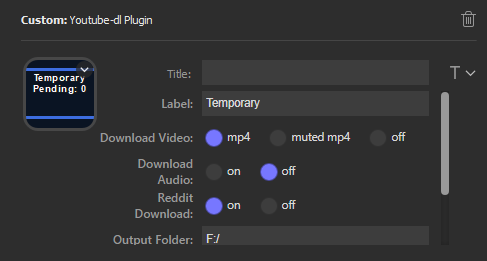
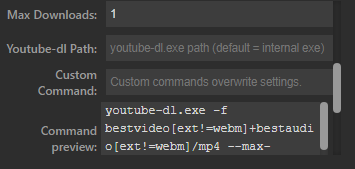

# Description

This is a Windows plugin for the Elgato Stream Deck that executes youtube-dl on a URL link copied to the clipboard once the button is pressed. It also has the additional feature of downloading media content from reddit URLs.

This plugin differs from a SuperMacro solution in the following ways:
-	This plugin has no dependancies. It is a lightweight solution for only this specific task.
-	By controlling the youtube-dl process, this plugin can keep track of multiple downloads, log the reason for any failures, and gives the option to kill hanging download tasks.
-	This plugin allows for a easy way to update youtube-dl without the need for extra macro keys.
-	By holding the button, this plugin opens the output folder to allow easy access to recent downloads.
-	This plugin also downloads images and videos from reddit if given a reddit URL.

# Use cases:
-	Archive videos or images from Reddit posts, Youtube, Twitch clips, etc.
-	Multiple buttons with different output folders allows for easy organization of downloads.

# Basic Settings

`Label`

Label you can set to keep track of the button's functionality. It will be displayed on the Stream Deck button.

`Download Settings`

Settings for the button's functionality. One or more options can be selected and the button will attempt them all when the button is pressed, using the most recently copied content in your clipboard as the url:

Download Video: Attempt the download of a mp4 or audio-less mp4 from the url.

Download Audio: Attempt the download of a mp3 file.

Reddit Download: Attempt the download of content from a reddit post.

Multiple download settings can be enabled. For example, enabling both Reddit Download and Download Video will have the button attempt to do both.

The "Reddit Download" option is special in that it does not log a failure if Video or Audio downloads were selected and downloaded successfully. It will only trigger a failure if it is the only download method selected, or if every selected download method has failed.

`Output Folder`

The output folder location for where the downloaded content will be saved. Holding the button for this plugin down will open this folder.

# Advanced Settings

Max Downloads: Allows the user to limit the number of downloads as a safeguard against downloading from a playlist link with many videos.

Youtube-dl Path: Allows the user to set a custom path to youtube-dl.exe. This plugin unpacks it's own youtube-dl.exe directly from the plugin, but if the user chooses to use their own build they can place the file path here.

Custom Command: Allows the user to supply a custom youtube-dl command. The plugin will invoke this command as `<youtube-dl path> <your command> <url>` sequentially with any other download options selected in the Basic Settings. This allows the user to create custom youtube-dl commands for their prefered quality or resolution or playlist settings.

Command Preview: Gives the user a preview of all the calls to youtube-dl invoked by this button.

Update: Calls youtube-dl --update

Kill Tasks: Gives the user the option to kill any hanging download tasks. Kill Button Tasks kills only tasks launched by this button, and Kill All Tasks will kill pending tasks launched by all buttons.

# Error Logging

If the download could not be completed, a short error message is displayed on the button iteself. More detailed logs are available at:

`<Your AppData Folder>\Roaming\Elgato\StreamDeck\logs\com.elgato.youtube-dl-plugin0.log`

Causes of errors include:
- Bad clipboard data. The button will indicate a failure if the clipboard content is not a url.
- Bad output folder or missing youtube-dl.exe
- Youtube-dl has failed for it's own reasons

# Installation

Download the file `com.elgato.streamdeck-youtube-dl-plugin.streamDeckPlugin` from the Release folder.

Executing this file will install the plugin to your Stream Deck.

# Support the Developer

If you like the plugin and want to give a small donation, you can use the links below. Thanks!

